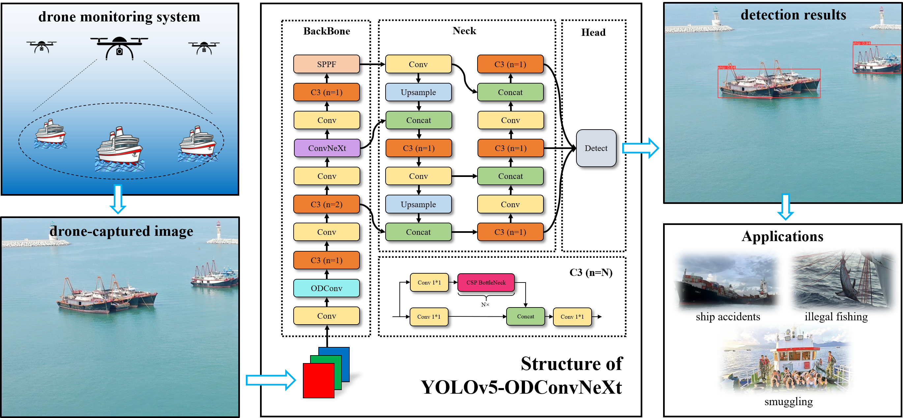
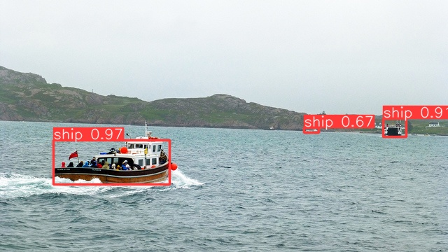
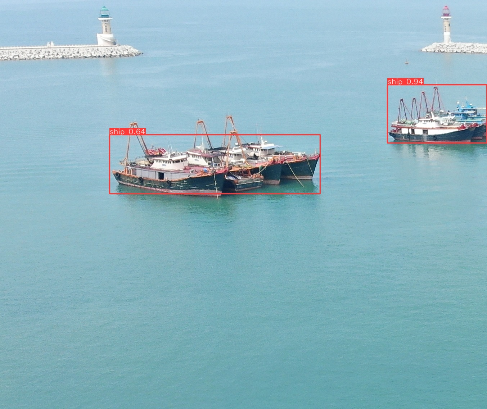

# YOLOv5-ODConvNeXt
YOLOv5-ODConvNeXt is an improved version of YOLOv5s for ship detection on drone-captured images. 



## Install

```bash
git clone https://github.com/chengshuxiao/YOLOv5-ODConvNeXt.git  # clone
cd YOLOv5-ODConvNeXt
pip install -r requirements.txt  # install
```

## Inference with detect.py

A trained YOLOv5-ODConvNeXt model is provided in `checkpoints/yolov5-odconvnext.pt`，the detection results are saved in `runs/detect`

```bash
python detect.py
    --weights checkpoints/yolov5-odconvnext.pt
    --source data/images
    --line-thickness 2
```

Two demo outputs are shown below.





## Train

The configuration of our model is in `models/yolov5-odconvnext.yaml`

```bash
python train.py
    --data data/MyShip3200.yaml
    --cfg models/yolov5-odconvnext.yaml
    --hyp data/hyps/hyp.scratch-low.yaml
    --epoch 500
    --batch-size 32
    --device 0
    --workers 8
```

## Dataset

Our ship dataset will be released soon.  

## References

Thanks to their great works.

- [ultralytics/yolov5](https://github.com/ultralytics/yolov5)
- [facebookresearch/ConvNeXt](https://github.com/facebookresearch/ConvNeXt)
- [OSVAI/ODConv](https://github.com/OSVAI/ODConv)